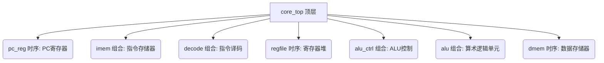

# CLAUDE.md

This file provides guidance to Claude Code (claude.ai/code) when working with code in this repository.

## Overview

This is a **RISC-V CPU core implementation** project written in SystemVerilog. It's a learning project that builds a processor core step-by-step through incremental labs, implementing the classic 5-stage pipeline (IF, ID, EX, MEM, WB).

The project uses **Verilator** for simulation and testing, converting Verilog to C++ for fast verification.

## Build and Test Commands

```bash
# Compile and run simulation
make run

# Just compile (without running)
make build

# Clean build artifacts
make clean
```

The Makefile automatically:
- Compiles all `.sv` files in `rtl/` with Verilator
- Links with the C++ testbench in `tb/sim_main.cpp`
- Creates output in `obj_dir/` directory

## Code Architecture

### Pipeline Stages

The CPU implements a standard RISC-V pipeline:

1. **IF (Instruction Fetch)**: `pc_reg.sv` + `imem.sv`
   - PC register stores current instruction address
   - Instruction memory reads instruction based on PC
   - PC increments by 4 each cycle

2. **ID (Instruction Decode)**: `decode.sv` + `regfile.sv`
   - Extracts instruction fields (opcode, rs1, rs2, rd, funct3, funct7)
   - Sign-extends immediate values
   - Reads register file (rs1, rs2)

3. **EX (Execute)**: `alu.sv` + `alu_ctrl.sv`
   - ALU performs arithmetic/logic operations
   - ALU control generates operation signals
   - Source MUX chooses between register and immediate

4. **MEM (Memory)**: `dmem.sv`
   - Data memory for load/store operations
   - Reads/writes based on address from ALU

5. **WB (Write Back)**: `core_top.sv`
   - Writes result back to register file
   - MUX selects between ALU result and memory read

### Module Hierarchy

```
core_top (顶层)
├── pc_reg (时序: PC寄存器)
├── imem (组合: 指令存储器)
├── decode (组合: 指令解码)
├── regfile (时序: 寄存器堆)
├── alu_ctrl (组合: ALU控制)
├── alu (组合: 算术逻辑单元)
└── dmem (时序: 数据存储器)
```

### Key Design Decisions

1. **Include Paths**: Makefile uses `-I$(RTL_DIR)` to handle `includes defined in separate files
2. **Universal ID**: Uses `defines.svh` for global macro definitions (ALU ops)
3. **Verilator Warnings**: Uses `/* verilator lint_off UNUSED */` comments for intentionally unused signals
4. **Port Naming**: Consistent suffixes (`_i` = input, `_o` = output, `_w` = internal wire)

## Design Patterns

### RTL Coding Style

- **Sequential Logic**: `always_ff @(posedge clk or posedge rst)` with non-blocking `<=` assignments
- **Combinational Logic**: `always_comb` or `assign` statements with blocking `=` assignments
- **Parameterization**: Uses `parameter` and `define` for configurable constants
- **Reset**: Asynchronous, high-active reset (`posedge rst`)

### Debug Output

The C++ testbench (`sim_main.cpp`) tracks:
- PC value
- Instruction machine code
- Register file contents (rs1, rs2)
- ALU results
- Data memory reads

## File Structure

```
.
├── Makefile                 # Build configuration
├── rtl/                     # RTL source files
│   ├── core_top.sv         # Top-level module
│   ├── pc_reg.sv           # PC register
│   ├── imem.sv             # Instruction memory
│   ├── decode.sv           # Instruction decoder
│   ├── regfile.sv          # Register file
│   ├── alu.sv              # Arithmetic Logic Unit
│   ├── alu_ctrl.sv         # ALU control logic
│   ├── dmem.sv             # Data memory
│   └── defines.svh         # Global macros
├── tb/                      # Testbench files
│   └── sim_main.cpp        # C++ Verilator testbench
├── doc/                     # Documentation
│   ├── 01_Lab1_PC_Design.md
│   ├── 02_Lab2_Instruction_Fetch.md
│   ├── 03_Lab3_Instruction_Decode.md
│   ├── 04_Lab4_Execute.md
│   └── VerilogHDL_StudyGuide.md  # Comprehensive HDL guide
└── obj_dir/                 # Generated by Verilator (not in repo)
```

## Supported RISC-V Instructions

Currently implemented:
- **I-Type**: `ADDI` (add immediate)
- **R-Type**: `ADD`, `SUB`, `AND`, `OR`
- **Load/Store**: `LW` (load word), `SW` (store word)

The `imem.sv` contains pre-loaded test instructions:
```assembly
0x00: addi x1, x0, 10   # x1 = 10
0x04: addi x2, x0, 20   # x2 = 20
0x08: add x3, x1, x2    # x3 = 30
0x0C: addi x0, x0, 0    # NOP
```

## Common Tasks

### Adding New Instructions

1. **Update `defines.svh`**: Add ALU opcode definitions
2. **Update `alu.sv`**: Add operation cases
3. **Update `alu_ctrl.sv`**: Map instruction to ALU op
4. **Update `decode.sv`**: Handle instruction format
5. **Update `imem.sv`**: Add test instruction

### Debugging Simulation

The testbench printf shows cycle-by-cycle state. For deeper analysis:
- Verilator supports waveform generation (VCD files)
- Check `obj_dir/Vcore_top.yaml` for signal names

### Fixing Warnings

Common Verilator warnings:
- **UNUSED**: Signals declared but not used → wrap with `lint_off` comments
- **WIDTH**: Bit width mismatches → explicitly declare sizes (`logic[31:0]`)
- **IMPLICIT**: Implicit nets → declare all signals explicitly

## References

- **Lab Docs**: See `doc/0[1-4]_Lab*.md` for step-by-step implementation guides
- **Verilog Guide**: `doc/VerilogHDL_StudyGuide.md` covers theory and common pitfalls
- **RISC-V Spec**: Uses RISC-V 32-bit base instruction set (RV32I)

---

# CLAUDE.md (中文版)

## 概览 (Overview)

这是一个 RISC-V CPU 核心实现项目，使用 SystemVerilog 编写。它是一个学习项目，通过增量实验 (Labs) 逐步构建一个处理器核心，实现了经典的五级流水线 (IF, ID, EX, MEM, WB)：取指、译码、执行、访存、写回。

本项目使用 Verilator 进行仿真和测试，将 Verilog 转换为 C++ 以实现快速验证。

## 构建和测试命令 (Build and Test Commands)

```bash
# 编译并运行仿真
make run

# 仅编译 (不运行)
make build

# 清理构建产物
make clean
```

`Makefile` 会自动完成以下操作：

*   使用 Verilator 编译 `rtl/` 目录下的所有 `.sv` 文件。
*   链接 `tb/sim_main.cpp` 中的 C++ 测试平台。
*   在 `obj_dir/` 目录下创建输出文件。

## 代码架构 (Code Architecture)

### 流水线阶段 (Pipeline Stages)

该 CPU 实现了一个标准的 RISC-V 流水线：

| 阶段 | 英文缩写 | 中文名称 | 主要文件 | 功能描述 |
| :--- | :--- | :--- | :--- | :--- |
| IF | Instruction Fetch | 取指 | `pc_reg.sv` + `imem.sv` | PC 寄存器存储当前指令地址；指令存储器根据 PC 读取指令；PC 每周期自增 4。 |
| ID | Instruction Decode | 指令译码 | `decode.sv` + `regfile.sv` | 提取指令字段 (opcode, rs1, rs2, rd, funct3, funct7)；对立即数进行符号扩展；读取寄存器堆 (rs1, rs2)。 |
| EX | Execute | 执行 | `alu.sv` + `alu_ctrl.sv` | ALU 执行算术/逻辑操作；ALU 控制逻辑生成操作信号；源操作数多路选择器选择寄存器值或立即数。 |
| MEM | Memory | 访存 | `dmem.sv` | 用于加载/存储操作的数据存储器；根据 ALU 提供的地址进行读/写操作。 |
| WB | Write Back | 写回 | `core_top.sv` | 将结果写回寄存器堆；多路选择器选择 ALU 结果或内存读取结果。 |

### 模块层级结构 (Module Hierarchy)



## 关键设计决策 (Key Design Decisions)

*   **包含路径 (Include Paths):** `Makefile` 使用 `-I$(RTL_DIR)` 来处理在单独文件中定义的包含 (includes)。
*   **通用定义 (Universal ID):** 使用 `defines.svh` 文件进行全局宏定义（如 ALU 操作码）。
*   **Verilator 警告 (Verilator Warnings):** 使用 `/* verilator lint_off UNUSED */` 注释来处理设计中故意未使用的信号。
*   **端口命名 (Port Naming):** 采用一致的后缀命名约定：
    *   `_i` = 输入
    *   `_o` = 输出
    *   `_w` = 内部连线 (internal wire)

## 设计模式 (Design Patterns)

### RTL 编码风格 (RTL Coding Style)

*   **时序逻辑 (Sequential Logic):** 使用 `always_ff @(posedge clk or posedge rst)` 配合非阻塞赋值 (`<=`)。
*   **组合逻辑 (Combinational Logic):** 使用 `always_comb` 或 `assign` 语句配合阻塞赋值 (`=`)。
*   **参数化 (Parameterization):** 使用 `parameter` 和 `define` 来定义可配置的常量。
*   **复位 (Reset):** 采用异步、高电平有效复位 (`posedge rst`)。

## 调试输出 (Debug Output)

C++ 测试平台 (`sim_main.cpp`) 会跟踪并输出以下信息：

*   PC 值
*   指令机器码
*   寄存器堆内容 (rs1, rs2)
*   ALU 结果
*   数据存储器读取结果

## 文件结构 (File Structure)

```
.
├── Makefile                 # 构建配置
├── rtl/                     # RTL 源文件
│   ├── core_top.sv         # 顶层模块
│   ├── pc_reg.sv           # PC 寄存器
│   ├── imem.sv             # 指令存储器
│   ├── decode.sv           # 指令译码器
│   ├── regfile.sv          # 寄存器堆
│   ├── alu.sv              # 算术逻辑单元
│   ├── alu_ctrl.sv         # ALU 控制逻辑
│   ├── dmem.sv             # 数据存储器
│   └── defines.svh         # 全局宏定义
├── tb/                      # 测试平台文件
│   └── sim_main.cpp        # C++ Verilator 测试平台
├── doc/                     # 文档
│   ├── 01_Lab1_PC_Design.md
│   ├── 02_Lab2_Instruction_Fetch.md
│   ├── 03_Lab3_Instruction_Decode.md
│   ├── 04_Lab4_Execute.md
│   └── VerilogHDL_StudyGuide.md  # 综合 HDL 指南
└── obj_dir/                 # 由 Verilator 生成 (不在仓库中)
```

## 支持的 RISC-V 指令 (Supported RISC-V Instructions)

当前已实现的指令：

*   **I-Type (立即数类型):** `ADDI` (立即数加法)
*   **R-Type (寄存器类型):** `ADD`, `SUB`, `AND`, `OR`
*   **Load/Store (加载/存储):** `LW` (加载字), `SW` (存储字)

`imem.sv` 中包含预加载的测试指令：

```assembly
0x00: addi x1, x0, 10   # x1 = 10
0x04: addi x2, x0, 20   # x2 = 20
0x08: add x3, x1, x2    # x3 = 30
0x0C: addi x0, x0, 0    # NOP (空操作)
```

## 常见任务 (Common Tasks)

### 添加新指令 (Adding New Instructions)

1.  更新 `defines.svh`: 添加 ALU 操作码定义。
2.  更新 `alu.sv`: 添加相应的操作实现。
3.  更新 `alu_ctrl.sv`: 将指令映射到 ALU 操作码。
4.  更新 `decode.sv`: 处理新的指令格式。
5.  更新 `imem.sv`: 添加测试指令。

### 调试仿真 (Debugging Simulation)

*   测试平台中的 `printf` 会显示逐周期的状态。
*   进行更深入的分析：
    *   Verilator 支持波形生成 (VCD 文件)。
    *   检查 `obj_dir/Vcore_top.yaml` 以获取信号名称。

### 修复警告 (Fixing Warnings)

常见的 Verilator 警告：

*   **UNUSED:** 声明但未使用的信号 → 使用 `lint_off` 注释包裹。
*   **WIDTH:** 位宽不匹配 → 显式声明位宽 (例如 `logic[31:0]`)。
*   **IMPLICIT:** 隐式网络 → 显式声明所有信号。

## 参考资料 (References)

*   **实验文档 (Lab Docs):** 请参阅 `doc/0[1-4]_Lab*.md` 获取逐步实现指南。
*   **Verilog 指南 (Verilog Guide):** `doc/VerilogHDL_StudyGuide.md` 涵盖了理论和常见陷阱。
*   **RISC-V 规范 (RISC-V Spec):** 使用 RISC-V 32位基本指令集 (RV32I)。